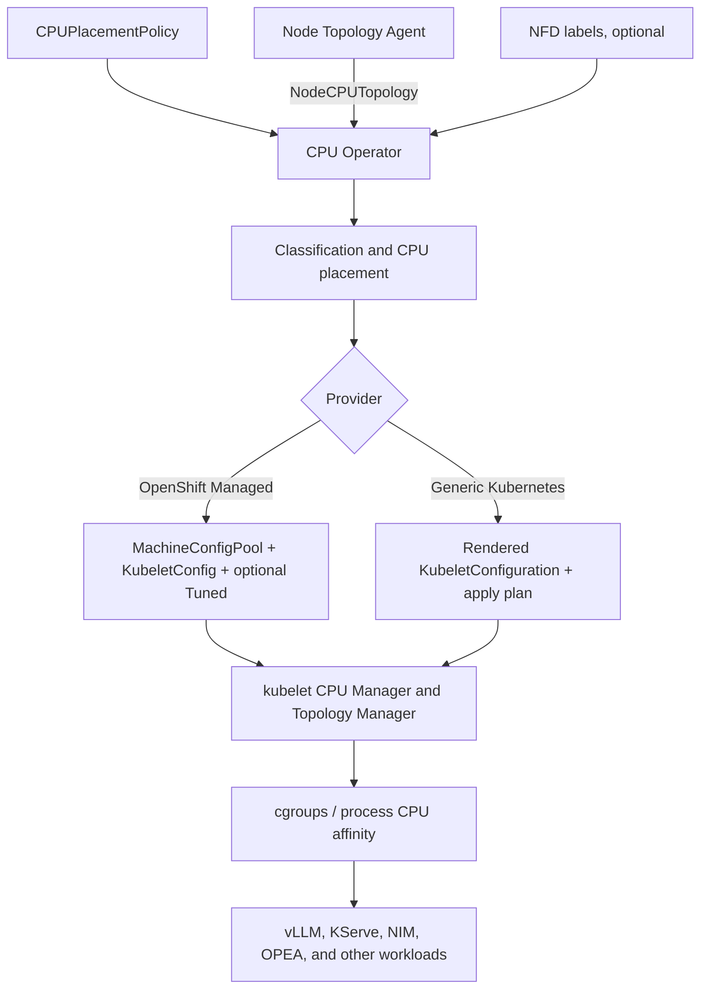

# CPU Operator

CPU Operator provides CPU-aware placement policy for Kubernetes and OpenShift inference workloads. It discovers CPU and NUMA topology, classifies worker nodes, computes placement policy, and prepares provider-specific kubelet configuration for CPU Manager and Topology Manager.

The baseline runtime remains Kubernetes-native:

- kubelet CPU Manager assigns exclusive CPUs;
- kubelet Topology Manager aligns CPU, memory, and device locality;
- Linux cgroups and process affinity enforce the CPUs visible to a container;
- CPU Operator discovers topology, calculates policy, labels nodes, and renders or applies provider configuration.

> **Project status:** this repository is a proof of concept. Review generated policy and node-change plans before using managed apply modes on production clusters.

## What the operator does

1. The Node Topology Agent runs on each selected worker and publishes `NodeCPUTopology` status.
2. CPU Operator combines that topology with `CPUPlacementPolicy`, node labels, and optional NFD feature labels.
3. Each node is classified as `mixed-cpu-amx-gpu`, `cpu-amx`, `gpu-only`, or `cpu-only`.
4. The operator computes CPU pools, topology groups, node labels, CPU Manager settings, and Topology Manager settings.
5. The provider backend either applies OpenShift resources or renders a handoff plan for generic Kubernetes.



## Quick start

The commands below provide the shortest OpenShift installation, deployment, and test path. See [Deployment Guide](docs/DEPLOYMENT.md) for generic Kubernetes, private registries, provider modes, upgrades, and cleanup.

### 1. Prerequisites

- an OpenShift cluster and a user with cluster-admin-equivalent permissions;
- at least one node labeled `node-role.kubernetes.io/worker`;
- `oc`, `python3`, and Docker or Podman;
- a registry that worker nodes can pull from;
- PyYAML for the live-node validation script:

```bash
python3 -m pip install pyyaml
```

### 2. Choose the container images

#### Use the prebuilt Quay images first

The repository manifests are already configured to use these proof-of-concept images:

| Component | Quay repository page | Image reference used by Docker, Podman, and Kubernetes |
|---|---|---|
| Node Topology Agent | <https://quay.io/repository/louie_tsai/node-topology-agent> | `quay.io/louie_tsai/node-topology-agent:dev` |
| CPU Operator | <https://quay.io/repository/louie_tsai/cpu-operator> | `quay.io/louie_tsai/cpu-operator:dev` |

The Quay URL containing `/repository/` is a browser page. Do not put that URL in `docker pull` or a Kubernetes `image:` field. Use the image reference in the last column.

Verify that the images are pullable from an environment with registry access:

```bash
docker pull quay.io/louie_tsai/node-topology-agent:dev
docker pull quay.io/louie_tsai/cpu-operator:dev

# Podman equivalent
podman pull quay.io/louie_tsai/node-topology-agent:dev
podman pull quay.io/louie_tsai/cpu-operator:dev
```

Confirm the manifests use the expected references:

```bash
grep image agent/daemonset.yaml operator/deployment.yaml
```

Expected values:

```text
quay.io/louie_tsai/node-topology-agent:dev
quay.io/louie_tsai/cpu-operator:dev
```

These `dev` images are intended for evaluating the current proof of concept. For controlled or production-oriented deployments, publish images in a registry you manage and use an immutable version tag or digest.

#### Optional: build and publish your own images

From the repository root, replace the registry namespace and tag:

```bash
REGISTRY=quay.io
REGISTRY_NS=<your-registry-namespace>
TAG=<version-or-development-tag>

AGENT_IMAGE=${REGISTRY}/${REGISTRY_NS}/node-topology-agent:${TAG}
OPERATOR_IMAGE=${REGISTRY}/${REGISTRY_NS}/cpu-operator:${TAG}

docker build -t "${AGENT_IMAGE}" agent/
docker build -t "${OPERATOR_IMAGE}" operator/
docker login "${REGISTRY}"
docker push "${AGENT_IMAGE}"
docker push "${OPERATOR_IMAGE}"
```

Update the deployment manifests to use the custom images:

```bash
sed -i "s|image: .*node-topology-agent:.*|image: ${AGENT_IMAGE}|" agent/daemonset.yaml
sed -i "s|image: .*cpu-operator:.*|image: ${OPERATOR_IMAGE}|" operator/deployment.yaml

grep image agent/daemonset.yaml operator/deployment.yaml
```

### 3. Install and deploy on OpenShift

```bash
# Namespace, service accounts, and RBAC
oc apply -f rbac.yaml

# Custom resources
oc apply -f crds.yaml

# The topology agent reads host /sys and /proc through hostPath mounts.
oc adm policy add-scc-to-user privileged \
  -z node-topology-agent \
  -n cpu-operator-system

# Runtime components
oc apply -f agent/daemonset.yaml
oc apply -f operator/deployment.yaml

# OpenShift managed provider policy
oc apply -f examples/cpu-placement-policy.yaml
```

The example policy uses `provider.type: OpenShift` and `provider.applyMode: Managed`. It can create or update `MachineConfigPool` and `KubeletConfig` resources. Review the policy and generated manifests before applying it to a production cluster.

### 4. Verify the deployment

```bash
oc rollout status ds/node-topology-agent -n cpu-operator-system
oc rollout status deploy/cpu-operator -n cpu-operator-system

oc get pods -n cpu-operator-system -o wide
oc get nodecputopologies -n cpu-operator-system
oc get cpuplacementpolicies -n cpu-operator-system
oc get configmap auto-vllm-cpu-policy-computed-cpu-policy \
  -n cpu-operator-system

oc get nodes \
  -L cpu.example.com/node-class,cpu.example.com/topology-group,cpu.example.com/phase4-applied
```

On OpenShift, also verify Machine Config Operator rollout before scheduling test workloads:

```bash
oc get mcp
oc get kubeletconfig
```

### 5. Test one real worker and runtime CPU assignment

Select one worker and validate its class, placement, topology group, labels, and provider outputs:

```bash
NODE=<worker-node-name>
scripts/test-worker-node-output.sh "${NODE}"
```

Confirm that CPU Manager static policy is active on the worker:

```bash
oc debug "node/${NODE}" --quiet -- \
  chroot /host \
  cat /var/lib/kubelet/cpu_manager_state
```

Generate and deploy a Guaranteed-QoS CPU test pod:

```bash
./scripts/generate-vllm-cpu-test-pod.sh
oc apply -f examples/vllm-cpu-test-pod.generated.yaml
```

Compare kubelet CPU Manager assignments with live process affinity across the worker:

```bash
LIVE=1 VIEW=both \
  scripts/show-pod-cpus-grouped.sh "${NODE}"
```

A shared CPU set is an allowed scheduling boundary, not evidence that every pod is actively consuming every CPU. See [Testing and Validation](docs/TESTING.md) for the lifecycle mapping, expected results, and failure localization.

## Provider modes

| Provider | Apply mode | Behavior |
|---|---|---|
| `OpenShift` | `Managed` | Generates and applies `MachineConfigPool`, `KubeletConfig`, node labels, and optional `Tuned` resources. |
| `OpenShift` | `RecommendationOnly` | Generates OpenShift resources in the computed policy ConfigMap without applying them. |
| `GenericKubernetes` | `RecommendationOnly` | Renders per-node `KubeletConfiguration` and a safe external apply plan without mutating worker hosts. |

The current CRD accepts only `OpenShift` and `GenericKubernetes` provider types, and only `Managed` and `RecommendationOnly` apply modes. Generic Kubernetes has no upstream equivalent of OpenShift Machine Config Operator, so its current supported mode is `RecommendationOnly`.

## Default node classes

| Node class | Typical node | Default placement |
|---|---|---|
| `mixed-cpu-amx-gpu` | GPU and AMX-capable CPU | `gpuPodReservedCPUs=24` logical CPUs as a balanced GPU-workload placement/capacity target; remaining CPUs form the CPU inference reference pool. |
| `cpu-amx` | AMX-capable CPU node without GPU | `reservedOtherPodsPerNuma=1` logical CPU per NUMA for system/shared work, mapped to `reservedSystemCPUs`; remaining CPUs form the CPU inference reference pool. |
| `gpu-only` | GPU node without required AMX capabilities | Prefer CPU and memory from one NUMA node. |
| `cpu-only` | General CPU node | Prefer CPU and memory from one NUMA node. |

The placement counts above are logical CPUs / vCPUs, not physical-core counts. `gpuPodReservedCPUs` is not a kubelet system reservation: the mixed-class `gpuPodCPUSet` remains allocatable and is intentionally not mapped to `reservedSystemCPUs`.

The full classification order, placement fields, generated labels, and ConfigMap contract are documented in [Policy Reference](docs/POLICY_REFERENCE.md).

## Documentation portal

| Document | Contents |
|---|---|
| [Architecture](docs/ARCHITECTURE.md) | Components, inputs and outputs, reconciliation flow, provider backends, and design boundaries. |
| [Deployment Guide](docs/DEPLOYMENT.md) | Image build, OpenShift installation, generic Kubernetes deployment, provider selection, upgrades, and cleanup. |
| [Testing and Validation](docs/TESTING.md) | Real-worker validation, kubelet activation, Guaranteed-QoS workload testing, grouped CPU reports, and failure localization. |
| [Policy Reference](docs/POLICY_REFERENCE.md) | Node classes, classification priority, placement policies, generated labels, and output artifacts. |

## Workload requirements

Exclusive CPU Manager allocation requires a Guaranteed QoS pod with integer CPU requests equal to limits. Memory requests and limits should also match:

```yaml
resources:
  requests:
    cpu: "46"
    memory: "128Gi"
  limits:
    cpu: "46"
    memory: "128Gi"
```

Example placement:

```yaml
nodeSelector:
  cpu.example.com/topology-ready: "true"
  cpu.example.com/node-class: "cpu-amx"
```

The operator can recommend CPU IDs, but a normal pod asks kubelet for a CPU count. Without an additional enforcement mechanism, kubelet may assign a different valid set of CPU IDs that satisfies the configured CPU Manager and Topology Manager policies.

## Current implementation boundaries

- The Node Topology Agent is the placement-grade source for NUMA CPUs, sibling relationships, memory topology, and optional GPU locality.
- NFD is optional and is used primarily for hardware capability labels such as AMX and GPU presence.
- OpenShift is the managed node-configuration path through Machine Config Operator and Node Tuning Operator.
- Generic Kubernetes produces configuration and an apply plan; host mutation remains external in the current PoC.
- DRA and NRI are optional extensions, not requirements for baseline CPU pinning.
- `cpuPodCPUSet` and `gpuPodCPUSet` describe placement intent. kubelet CPU Manager does not natively understand named CPU pools.
