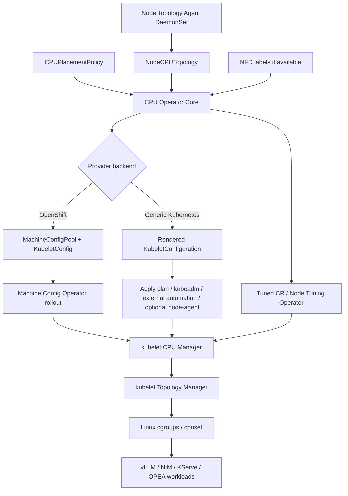
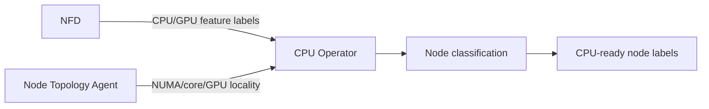
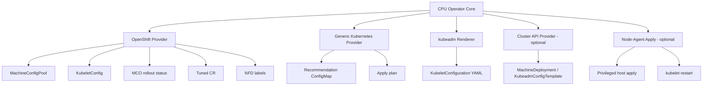
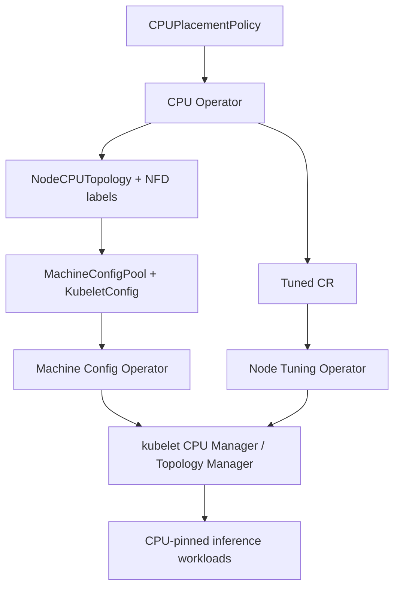
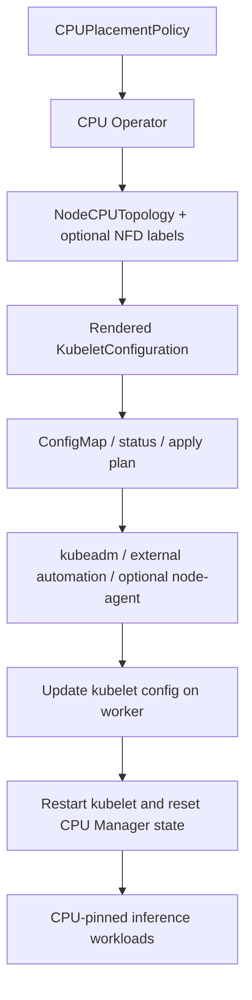

# CPU Operator

CPU Operator provides CPU-aware placement policy for Kubernetes and OpenShift AI inference workloads. It discovers CPU/NUMA topology, classifies worker nodes, computes CPU placement policy, and prepares nodes for kubelet CPU Manager and Topology Manager based CPU pinning.

The operator keeps the runtime path Kubernetes-native:

- kubelet CPU Manager owns exclusive CPU assignment.
- kubelet Topology Manager owns NUMA alignment.
- Linux cgroups/cpuset enforce final CPU visibility.
- CPU Operator orchestrates policy and provider-specific node configuration.

## Goals

- Discover CPU, NUMA, memory, thread-sibling, and optional GPU locality.
- Classify nodes with defined policies such as CPU-only and mixed CPU/GPU inference.
- Generate NUMA-aware `reservedSystemCPUs`.
- Configure OpenShift through native components: NFD, TuneD, MachineConfigPool, KubeletConfig, and MCO.
- Support generic Kubernetes through rendered kubelet config and apply plans.
- Validate workloads for Guaranteed QoS and CPU Manager eligibility.
- Keep DRA and NRI optional in the baseline design.

## Architecture



## Core components

### CPU Operator

The CPU Operator is the policy orchestration layer. It watches:

- `CPUPlacementPolicy`
- `NodeCPUTopology`
- node labels from NFD, when available

It produces:

- node classification;
- `reservedSystemCPUs`;
- desired kubelet CPU Manager / Topology Manager config;
- workload-facing node labels;
- OpenShift or generic Kubernetes provider outputs.

### Node Topology Agent

The Node Topology Agent runs as a DaemonSet on worker nodes and reports detailed topology that NFD usually does not expose.

It collects:

- NUMA CPU lists;
- physical core and hyperthread sibling mapping;
- memory topology;
- optional GPU PCI-to-NUMA locality;
- current kubelet CPU Manager / cpuset state.

Typical data sources include:

```bash
lscpu -e=CPU,CORE,SOCKET,NODE,ONLINE
numactl --hardware
cat /sys/devices/system/node/node*/cpulist
cat /sys/devices/system/cpu/cpu*/topology/thread_siblings_list
cat /var/lib/kubelet/cpu_manager_state
cat /sys/fs/cgroup/cpuset.cpus.effective
```

For GPU locality:

```bash
nvidia-smi topo -m
cat /sys/bus/pci/devices/<PCI_ID>/numa_node
```

## NFD and TuneD integration

### NFD

Use Node Feature Discovery as the preferred source for hardware feature labels when available.

Examples:

```text
feature.node.kubernetes.io/cpu-cpuid.AMX_BF16=true
feature.node.kubernetes.io/cpu-cpuid.AMX_INT8=true
feature.node.kubernetes.io/pci-10de.present=true
```



NFD is used for feature discovery. The Node Topology Agent is still required for placement-grade topology details.

### TuneD

On OpenShift, CPU Operator should use the Node Tuning Operator and `Tuned` custom resources.

CPU Operator should:

- reference or generate a `Tuned` CR;
- validate that the expected profile is applied;
- report tuning readiness in policy status.

On generic Kubernetes, there is no universal TuneD API. CPU Operator should render recommended TuneD/system settings and let external automation or an optional node-agent apply them.

## Provider backends

CPU Operator uses one shared core with provider-specific backends.



### OpenShift provider

The OpenShift provider is the managed apply path.

It should manage or validate:

- `MachineConfigPool`;
- OpenShift `KubeletConfig`;
- Machine Config Operator rollout status;
- `Tuned` CR through Node Tuning Operator;
- NFD labels;
- optional GPU Operator-visible resources;
- workload-facing labels for OpenShift AI, KServe, vLLM, and NIM.



### Generic Kubernetes provider

Generic Kubernetes does not have an upstream equivalent of OpenShift `MachineConfigPool`, `MachineConfig`, `KubeletConfig` CR, or Machine Config Operator.

The default generic Kubernetes mode should be `RecommendationOnly`.



Safe node update flow for generic Kubernetes:

```text
cordon/drain node
stop kubelet
backup kubelet config
write updated kubelet config
remove /var/lib/kubelet/cpu_manager_state
start kubelet
wait for Node Ready
uncordon node
validate CPU Manager static policy
```

## Workload requirements

For kubelet CPU Manager static policy, inference workloads should use Guaranteed QoS with integer CPU requests and matching limits.

```yaml
resources:
  requests:
    cpu: "46"
    memory: "128Gi"
  limits:
    cpu: "46"
    memory: "128Gi"
```

Recommended node labels:

```text
cpu.example.com/inference-ready=true
cpu.example.com/topology-ready=true
cpu.example.com/node-class=cpu-amx
cpu.example.com/amx-bf16=true
cpu.example.com/cpu-manager-static=true
cpu.example.com/topology-manager-policy=restricted
```

Example workload placement:

```yaml
nodeSelector:
  cpu.example.com/inference-ready: "true"
  cpu.example.com/node-class: "cpu-amx"
```

The CPU Operator admission webhook should validate or warn when:

- CPU request does not equal CPU limit;
- CPU request is not an integer;
- memory request does not equal memory limit;
- target node is not topology-ready;
- CPU Manager static policy is not active;
- requested NUMA placement is impossible.

## DRA

DRA is optional. Add it only when scheduler-visible CPU topology claims are required.

Possible future resource classes:

```text
cpu-pool-balanced
cpu-pool-single-numa
cpu-pool-gpu-near
cpu-pool-amx-enabled
```

Baseline CPU pinning uses kubelet CPU Manager, Topology Manager, and cgroup cpuset enforcement.

## Current PoC status

The current repository contains a proof-of-concept with:

```text
Node topology agent DaemonSet
  -> reads /sys and /proc topology
  -> writes NodeCPUTopology.status

CPU Operator Deployment
  -> watches NodeCPUTopology and CPUPlacementPolicy
  -> computes CPU placement policy
  -> writes <policy-name>-computed-cpu-policy ConfigMap
```

The computed ConfigMap is a recommendation unless an apply backend is enabled.

## Design principle

Use one CPU Operator with multiple provider backends:

```text
portable topology and placement core
  -> OpenShift provider using NFD, TuneD, MCP, KubeletConfig, and MCO
  -> generic Kubernetes provider using rendered config and apply plans
```

OpenShift has a managed node-configuration controller. Generic Kubernetes does not. CPU Operator should reflect that difference instead of trying to duplicate the full Machine Config Operator model outside OpenShift.
