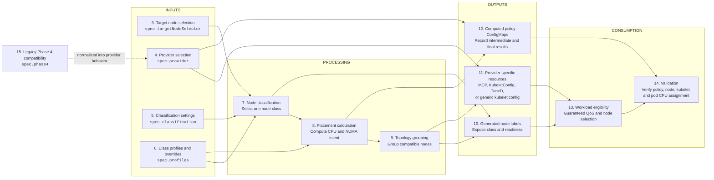
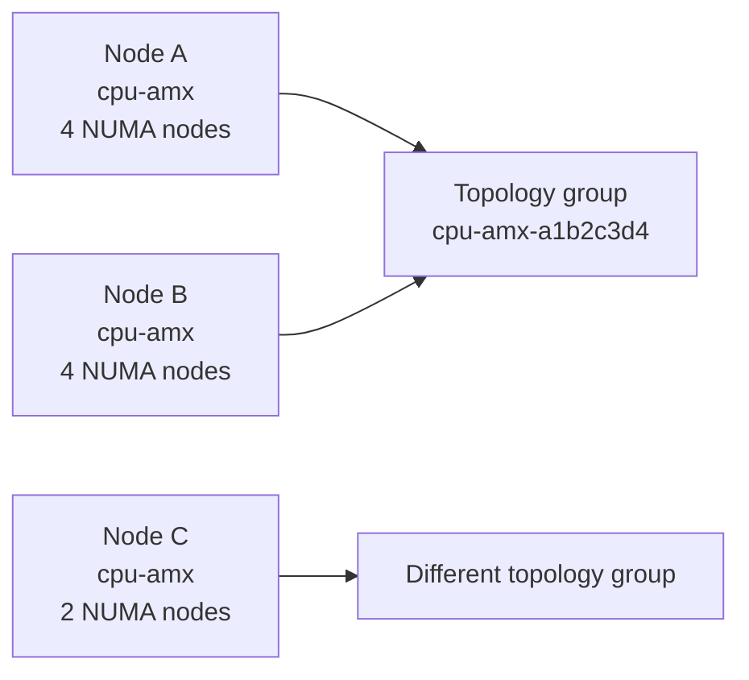
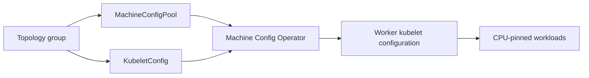
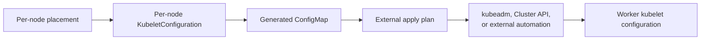
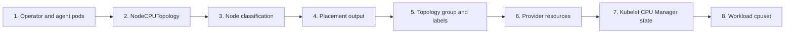
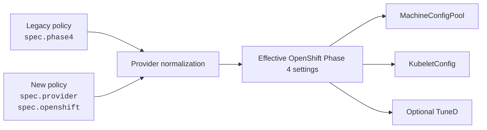

# CPUPlacementPolicy Reference

This document explains how a `CPUPlacementPolicy` moves through the CPU Operator from user input to node configuration and workload validation.

The sections follow one connected lifecycle:



In plain language:

```text
Policy inputs
  -> select target nodes
  -> classify each node
  -> choose the class profile
  -> calculate CPU/NUMA placement
  -> group nodes with compatible configuration
  -> generate labels, ConfigMaps, and provider resources
  -> schedule eligible workloads
  -> validate the resulting CPU assignment
```

---

## 1. Policy processing overview

A `CPUPlacementPolicy` is the user-facing input to the CPU Operator.

The operator combines the policy with:

- Kubernetes or OpenShift Node objects;
- `NodeCPUTopology` data from the Node Topology Agent;
- optional Node Feature Discovery labels;
- optional GPU resource and locality information.

The result is not one object. The operator produces several connected outputs:

1. a selected class for every processed node;
2. a placement calculation for every processed node;
3. topology groups containing compatible nodes;
4. generated node labels;
5. provider-specific configuration;
6. computed ConfigMaps for inspection and external consumption.

### Stage dependency summary

| Stage | Consumes | Produces | Used by |
|---|---|---|---|
| Node selection | `targetNodeSelector`, Node labels | Selected nodes | Classification |
| Classification | Selected nodes, topology, classification settings | One class per node | Profile selection and labels |
| Profile selection | Node class, `spec.profiles` | Effective policy for the class | Placement calculation |
| Placement | Topology and effective profile | CPU/NUMA placement intent | Topology grouping and ConfigMaps |
| Topology grouping | Class, topology signature, placement settings | Compatible node groups | OpenShift MCP/KubeletConfig rendering |
| Provider delivery | Provider type and apply mode | OpenShift resources or generic handoff | Kubelet configuration |
| Workload consumption | Labels and active kubelet settings | CPU-pinned workload | Validation |

---

## 2. Complete policy skeleton

```yaml
apiVersion: cpu.example.com/v1alpha1
kind: CPUPlacementPolicy
metadata:
  name: auto-vllm-cpu-policy
  namespace: cpu-operator-system
spec:
  provider:
    type: OpenShift
    applyMode: Managed

  targetNodeSelector:
    node-role.kubernetes.io/worker: ""

  nodeLabels:
    enabled: true
    prefix: cpu.example.com

  classification:
    overrideLabel: cpu.example.com/node-class-override
    amxNodeSelector:
      node-role.kubernetes.io/inference: ""
    gpuOnlyNodeSelector:
      cpu.example.com/gpu-only: "true"
    cpuAmxMinLogicalCPUs: 64

  profiles:
    mixed-cpu-amx-gpu:
      cpuManagerPolicy: static
      cpuManagerPolicyOptions:
        distribute-cpus-across-numa: "true"
        full-pcpus-only: "true"
      topologyManagerPolicy: restricted
      placement:
        strategy: balanced-shared-cpu-and-gpu
        gpuPodReservedCPUs: 12
        gpuPodDistribution: balanced-across-numa
        cpuPodPool: all-remaining-balanced-across-numa

    cpu-amx:
      cpuManagerPolicy: static
      cpuManagerPolicyOptions:
        distribute-cpus-across-numa: "true"
        full-pcpus-only: "true"
      topologyManagerPolicy: restricted
      placement:
        strategy: balanced-reserved-other-pods
        reservedOtherPodsPerNuma: 2
        cpuPodPool: all-remaining-balanced-across-numa

    gpu-only:
      cpuManagerPolicy: static
      cpuManagerPolicyOptions: {}
      topologyManagerPolicy: single-numa-node
      placement:
        strategy: same-numa-node-first

    cpu-only:
      cpuManagerPolicy: static
      cpuManagerPolicyOptions: {}
      topologyManagerPolicy: single-numa-node
      placement:
        strategy: same-numa-node-first

  openshift:
    machineConfigPoolNamePrefix: cpu
    manageKubeletConfig: true
    manageTuned: false
    tunedProfile: openshift-node-llm-compute
    topologyManagerScope: pod

  generic:
    outputConfigMap: auto-vllm-cpu-policy-generated-kubelet-config

  # Backward-compatible OpenShift configuration.
  phase4:
    enabled: true
    apply: true
    machineConfigPoolNamePrefix: cpu
    topologyManagerScope: pod
    pauseMachineConfigPool: false
```

The following sections explain how these fields move through the lifecycle.

---

# INPUTS

## 3. Target node selection

### Input

```yaml
spec:
  targetNodeSelector:
    node-role.kubernetes.io/worker: ""
```

The operator compares this selector with labels on each Kubernetes Node.

An empty string means the label key must exist, regardless of its value.

### Output

A set of worker nodes eligible for policy processing.

```text
All cluster nodes
  -> selector matches: continue to classification
  -> selector does not match: ignore for this policy
```

### Connection to the next section

Only selected nodes enter **Section 7: Node classification**.

The provider does not decide which nodes are classified. Provider selection only controls how the computed result is delivered.

---

## 4. Provider selection

### Input

```yaml
spec:
  provider:
    type: OpenShift
    applyMode: Managed
```

### Current supported values

| Field | Current values | Meaning |
|---|---|---|
| `spec.provider.type` | `OpenShift` | Render OpenShift MachineConfigPool, KubeletConfig, and optional TuneD resources. |
| `spec.provider.type` | `GenericKubernetes` | Render per-node kubelet configuration and an external apply plan. |
| `spec.provider.applyMode` | `Managed` | Apply supported provider resources. Currently meaningful for OpenShift. |
| `spec.provider.applyMode` | `RecommendationOnly` | Render outputs without applying node configuration. |

`Kubeadm`, `ClusterAPI`, `ExternalApply`, and `NodeAgent` are design concepts for future backends or apply paths. They are not current CRD enum values.

### Output

A normalized provider decision:

```yaml
type: OpenShift
applyMode: Managed
```

The normalized provider is written to `provider.yaml` in the computed policy ConfigMap.

### Connection to later sections

Provider selection does not change node classification or CPU placement.

It controls **Section 11: Provider-specific resources**:

```text
OpenShift + Managed
  -> render and apply MCP/KubeletConfig
  -> optionally render and apply TuneD

OpenShift + RecommendationOnly
  -> render OpenShift objects
  -> do not apply them

GenericKubernetes + RecommendationOnly
  -> render per-node KubeletConfiguration
  -> render an external apply plan
```

---

## 5. Classification settings

### Input

```yaml
spec:
  classification:
    overrideLabel: cpu.example.com/node-class-override
    amxNodeSelector:
      node-role.kubernetes.io/inference: ""
    gpuOnlyNodeSelector:
      cpu.example.com/gpu-only: "true"
    cpuAmxMinLogicalCPUs: 64
```

### Field meanings

| Field | Purpose |
|---|---|
| `overrideLabel` | Allows a valid manual node-class request through a Node label. |
| `amxNodeSelector` | Explicitly identifies AMX-capable nodes intended for CPU inference. |
| `gpuOnlyNodeSelector` | Forces matching GPU nodes into the `gpu-only` class. |
| `cpuAmxMinLogicalCPUs` | Allows large AMX nodes to qualify for `cpu-amx` without an explicit selector. |

A manual override requesting an AMX class is rejected if AMX BF16 or AMX INT8 is missing.

### Output

Classification criteria used in **Section 7**.

These settings do not directly generate CPU sets.

### Connection to the next section

The selected class determines which profile in **Section 6** becomes effective.

---

## 6. Class profiles and overrides

### Input

```yaml
spec:
  profiles:
    cpu-amx:
      cpuManagerPolicy: static
      cpuManagerPolicyOptions:
        distribute-cpus-across-numa: "true"
        full-pcpus-only: "true"
      topologyManagerPolicy: restricted
      placement:
        strategy: balanced-reserved-other-pods
        reservedOtherPodsPerNuma: 2
```

Each node class has one profile.

### Supported node classes

| Class | Intended node |
|---|---|
| `mixed-cpu-amx-gpu` | GPU node that also supports AMX BF16 and AMX INT8 |
| `cpu-amx` | CPU inference node with AMX BF16 and AMX INT8 |
| `gpu-only` | GPU node that does not qualify for the mixed AMX class |
| `cpu-only` | General CPU node that does not qualify for `cpu-amx` |

### Profile fields

| Field | Consumed by |
|---|---|
| `cpuManagerPolicy` | Generated kubelet configuration |
| `cpuManagerPolicyOptions` | Generated kubelet configuration and topology signature |
| `topologyManagerPolicy` | Generated kubelet configuration |
| `placement.strategy` | Placement calculation |
| `gpuPodReservedCPUs` | Mixed CPU/GPU placement |
| `reservedOtherPodsPerNuma` | AMX CPU placement |
| `cpuPodPool` | Placement description and output |

### Output

An effective profile for the class selected in **Section 7**.

### Connection to processing

```text
Node classification
  -> selected node class
  -> profile for that class
  -> placement calculation
```

---

# PROCESSING

## 7. Node classification

The operator evaluates each selected node using:

- manual override label;
- GPU detection;
- AMX BF16 support;
- AMX INT8 support;
- explicit selectors;
- logical CPU count.

### Classification order

| Priority | Condition | Result |
|---:|---|---|
| 1 | Valid manual override | Requested class, subject to AMX validation |
| 2 | GPU present and `gpuOnlyNodeSelector` matches | `gpu-only` |
| 3 | GPU present and AMX BF16/INT8 supported | `mixed-cpu-amx-gpu` |
| 4 | GPU present without required AMX support | `gpu-only` |
| 5 | No GPU, AMX supported, and `amxNodeSelector` matches | `cpu-amx` |
| 6 | No GPU, AMX supported, and logical CPU count meets the minimum | `cpu-amx` |
| 7 | No earlier rule matches | `cpu-only` |

### Output

One class and classification reason per node.

Example:

```yaml
worker-0:
  class: mixed-cpu-amx-gpu
  reason:
    gpuCount: 8
    logicalCPUs: 344
    amx:
      amx_bf16: true
      amx_int8: true
```

### Connection to the next section

The class selects an effective profile, which is passed with node topology to **Section 8: Placement calculation**.

---

## 8. Placement calculation

Placement calculation combines:

```text
NodeCPUTopology
  + selected node class
  + effective class profile
  = per-node placement result
```

### Default placement by class

| Class | Strategy | Important output |
|---|---|---|
| `mixed-cpu-amx-gpu` | `balanced-shared-cpu-and-gpu` | `gpuPodCPUSet`, `cpuPodCPUSet` |
| `cpu-amx` | `balanced-reserved-other-pods` | `otherPodsReservedCPUSet`, `cpuPodCPUSet` |
| `gpu-only` | `same-numa-node-first` | `numaLocalCPUSetByNuma`, `preferredNumaNode` |
| `cpu-only` | `same-numa-node-first` | `numaLocalCPUSetByNuma`, `preferredNumaNode` |

Example mixed-node result:

```yaml
strategy: balanced-shared-cpu-and-gpu
gpuPodCPUSet: 0-2,43-45,86-88,129-131
cpuPodCPUSet: 3-42,46-85,89-128,132-171
cpuManagerPolicy: static
topologyManagerPolicy: restricted
```

### Important limitation

`gpuPodCPUSet` and `cpuPodCPUSet` describe placement intent.

Kubelet CPU Manager normally receives an integer CPU request and chooses exact logical CPU IDs. It does not independently understand the operator's conceptual CPU-pod and GPU-pod pools.

### `reservedSystemCPUs`

For `cpu-amx`, the balanced other-pods set can become `reservedSystemCPUs`.

For `mixed-cpu-amx-gpu`, the GPU-support CPU set must not automatically become `reservedSystemCPUs`, because that would remove those CPUs from kubelet's exclusive allocation pool.

### Output

Per-node placement data written to:

```text
cpuPlacementByNode.yaml
```

### Connection to the next section

The class, topology shape, placement strategy, GPU-local NUMA information, and CPU Manager options form a topology signature used by **Section 9**.

---

## 9. Topology grouping

OpenShift `KubeletConfig` applies to a `MachineConfigPool`, not independently to each node.

The operator therefore groups nodes that need compatible configuration.



### Topology signature inputs

The grouping signature includes:

- node class;
- CPUs per NUMA node;
- GPU-local NUMA nodes;
- AMX support;
- placement strategy;
- CPU reservation settings;
- CPU Manager policy options.

### Output

A stable topology-group name and a group record:

```yaml
cpu-amx-a1b2c3d4:
  nodeClass: cpu-amx
  cpuManagerPolicy: static
  topologyManagerPolicy: restricted
  placementStrategy: balanced-reserved-other-pods
  nodes:
    - worker-0
    - worker-1
```

### Connection to outputs

Topology groups drive:

- the `cpu.example.com/topology-group` node label;
- one OpenShift `MachineConfigPool` per group;
- one OpenShift `KubeletConfig` per group;
- topology-group information in computed ConfigMaps.

---

# OUTPUTS

## 10. Generated node labels

Generated labels expose processing results on each Node.

| Label suffix | Source stage | Purpose |
|---|---|---|
| `topology-ready` | Topology discovery | Topology was available and processed |
| `node-class` | Classification | Selected node class |
| `topology-group` | Topology grouping | Compatible configuration group |
| `placement-strategy` | Placement | Selected strategy |
| `gpu-count` | Hardware discovery | Detected GPU count |
| `gpu-local-numa` | Hardware discovery | GPU-local NUMA nodes |
| `amx-supported` | Hardware discovery | Both AMX BF16 and INT8 are available |
| `placement-ready` | Placement | Placement was calculated |
| `phase4-applied` | Provider delivery | OpenShift managed apply succeeded |

Example:

```text
cpu.example.com/topology-ready=true
cpu.example.com/node-class=cpu-amx
cpu.example.com/topology-group=cpu-amx-a1b2c3d4
cpu.example.com/placement-strategy=balanced-reserved-other-pods
cpu.example.com/amx-supported=true
cpu.example.com/phase4-applied=true
```

### Connection to consumption

Workloads can use these labels in `nodeSelector` or node affinity.

---

## 11. Provider-specific resources

Provider selection from **Section 4** determines how the processing results are delivered.

### OpenShift provider



For each topology group, the operator renders:

- one `MachineConfigPool`;
- one `KubeletConfig`;
- optionally one `Tuned` resource for the configured tuning profile.

`Managed` applies the supported resources.

`RecommendationOnly` records the rendered resources without applying them.

### Generic Kubernetes provider



Generic Kubernetes has no upstream equivalent of OpenShift MachineConfigPool and Machine Config Operator.

The operator therefore produces:

- one `<node>.kubelet-config.yaml` entry per processed node;
- `apply-plan.yaml`;
- a ConfigMap containing those artifacts.

### Output

Provider-specific resources and status:

```text
providerStatus
phase4Status
phase4MachineConfigPools.yaml
phase4KubeletConfigs.yaml
openshiftTuned.yaml
genericKubeletConfigs.yaml
genericApplyPlan.yaml
```

---

## 12. Computed policy ConfigMaps

The computed policy ConfigMap is the main audit record.

Default name:

```text
<policy-name>-computed-cpu-policy
```

### Intermediate outputs

| Key | Stage |
|---|---|
| `provider.yaml` | Provider normalization |
| `targetNodeSelector.yaml` | Target selection |
| `nodeClassification.yaml` | Classification |
| `cpuPlacementByNode.yaml` | Placement calculation |
| `topologyGroups.yaml` | Topology grouping |
| `generatedNodeLabels.yaml` | Label generation |

### Final provider outputs

| Key | Purpose |
|---|---|
| `providerStatus` | Provider reconciliation result |
| `phase4Status` | OpenShift generation/apply result |
| `phase4Error` | OpenShift apply error |
| `phase4MachineConfigPools.yaml` | Rendered MCP resources |
| `phase4KubeletConfigs.yaml` | Rendered KubeletConfig resources |
| `openshiftTuned.yaml` | Rendered TuneD resource |
| `genericKubeletConfigs.yaml` | Per-node generic kubelet configurations |
| `genericApplyPlan.yaml` | Safe external apply sequence |

A separate generic handoff ConfigMap contains:

```text
<node-name>.kubelet-config.yaml
apply-plan.yaml
```

### Connection to validation

The computed ConfigMaps let users inspect every transition in the lifecycle without inferring results from pod behavior alone.

---

# CONSUMPTION

## 13. Workload eligibility

A workload consumes two outputs from the earlier stages:

1. generated node labels for scheduling;
2. active kubelet CPU Manager and Topology Manager configuration.

### Node selection

```yaml
nodeSelector:
  cpu.example.com/topology-ready: "true"
  cpu.example.com/node-class: cpu-amx
```

### Guaranteed QoS

For exclusive CPU Manager allocation, use integer and equal CPU requests and limits.

```yaml
resources:
  requests:
    cpu: "8"
    memory: "16Gi"
  limits:
    cpu: "8"
    memory: "16Gi"
```

The pod must be recreated after the kubelet policy becomes active. An existing pod is not retroactively reassigned.

### Runtime result

```text
Eligible workload
  + matching node label
  + CPU Manager static policy
  + integer CPU request
  = exclusive CPU assignment
```

---

## 14. Validation

Validate in lifecycle order rather than starting with the pod.



### Validate operator outputs for one real worker

```bash
scripts/test-worker-node-output.sh <worker-node-name>
```

The script:

1. confirms the node is a worker;
2. reads its generated class;
3. applies only assertions for that class;
4. verifies placement and labels;
5. verifies provider status and generated resources;
6. prints `[PASS]` or `[FAIL]`;
7. exits nonzero when any assertion fails.

### Test all class contracts without a cluster

```bash
python3 scripts/test-node-class-outputs.py
```

Expected summary:

```text
[PASS] mixed-cpu-amx-gpu
[PASS] cpu-amx
[PASS] gpu-only
[PASS] cpu-only
[PASS] summary: 4/4 node classes passed
```

### Inspect the policy pipeline

```bash
examples/check_cpu_operator_io.sh
```

### Verify workload CPU assignment

```bash
grep Cpus_allowed_list /proc/self/status
cat /sys/fs/cgroup/cpuset.cpus.effective 2>/dev/null || true
```

For privileged or host-integrated containers, `/sys/fs/cgroup` may expose a broader host cgroup level. The process-level `Cpus_allowed_list` is the primary live affinity check.

---

## 15. Legacy Phase 4 compatibility

`spec.phase4` is the original OpenShift-only configuration path.

It is retained for backward compatibility.



### Legacy policy

```yaml
spec:
  phase4:
    enabled: true
    apply: true
```

When `spec.provider` is absent, the operator infers:

```yaml
provider:
  type: OpenShift
  applyMode: Managed
```

When `phase4.apply` is false, the inferred apply mode is `RecommendationOnly`.

When neither `provider` nor `phase4` is present, the operator defaults to generic recommendation-only behavior.

### New policy

```yaml
spec:
  provider:
    type: OpenShift
    applyMode: Managed

  openshift:
    machineConfigPoolNamePrefix: cpu
    topologyManagerScope: pod
```

### Recommendation

Use `spec.provider` and provider-specific sections for new policies.

Keep `spec.phase4` only when compatibility with the existing OpenShift implementation is required. When both forms appear, keep equivalent settings consistent to avoid ambiguous configuration.

---

## Complete relationship summary

```text
Policy input
  -> chooses nodes
  -> classifies hardware
  -> selects the class profile
  -> computes CPU and NUMA placement
  -> groups compatible nodes
  -> generates node labels
  -> renders or applies provider resources
  -> records all decisions in ConfigMaps
  -> enables eligible workloads
  -> validates kubelet and pod CPU assignment
```
