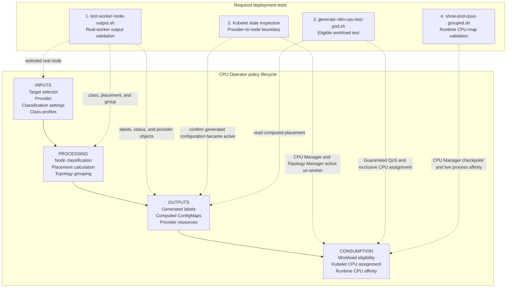
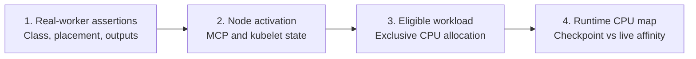
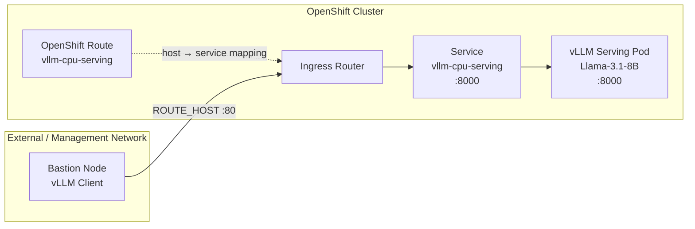

# Testing and Validation

This guide focuses on the four tests needed to validate a real CPU Operator deployment from policy output through runtime CPU assignment.

The tests follow the CPU Operator policy lifecycle:

```text
INPUTS -> PROCESSING -> OUTPUTS -> CONSUMPTION
```

## Policy lifecycle and required test coverage



### How the tests connect

The four tests validate consecutive boundaries:

```text
Real-worker policy result
  -> active kubelet configuration
  -> eligible workload CPU allocation
  -> runtime checkpoint and process-affinity agreement
```

A pass at one stage does not automatically prove the next stage.

For example:

- `test-worker-node-output.sh` validates the real worker through the provider-output stage but does not create a workload.
- Kubelet state inspection confirms the generated provider configuration became active on the worker.
- `generate-vllm-cpu-test-pod.sh` verifies that a Guaranteed-QoS pod receives exclusive CPUs.
- `show-pod-cpus-grouped.sh` provides the final node-wide runtime view.

## Lifecycle coverage matrix

| Test or validation step | INPUTS | PROCESSING | OUTPUTS | CONSUMPTION | What a pass proves |
|---|---|---|---|---|---|
| `scripts/test-worker-node-output.sh <node>` | **Validates** the selected real worker and policy output | **Validates** its class, placement, and topology group | **Validates** labels, provider status, and generated/applied resources | Not covered | The policy pipeline is internally consistent for one real worker through the provider-output stage. |
| Kubelet and MCP inspection | Not revalidated | Not revalidated | **Validates application** of provider resources | **Validates readiness** for eligible workloads | Generated configuration reached the worker and CPU Manager static policy is active. |
| `scripts/generate-vllm-cpu-test-pod.sh` | Reads selected policy/node data | Uses computed CPU-pod capacity | Reads computed placement | **Validates** Guaranteed QoS, exclusive CPU count, checkpoint entry, and process affinity | An eligible pod can consume the configured CPU Manager capacity. |
| `LIVE=1 VIEW=both scripts/show-pod-cpus-grouped.sh <node>` | Not covered | Not covered | Reads CPU Manager checkpoint | **Validates** shared/exclusive groups and manager-to-live affinity agreement | Runtime container affinity agrees with kubelet CPU Manager state. |

## Recommended execution order



Run the tests in this order:

1. Validate one real worker's class, placement, topology group, labels, and provider resources.
2. Confirm the provider configuration is active in kubelet.
3. Create a Guaranteed-QoS workload and validate exclusive CPU allocation.
4. Inspect the node-wide shared and exclusive CPU map.

Do not skip directly to workload testing when real-worker or kubelet validation is failing. A pod symptom often originates in provider rollout or kubelet activation.

## Test matrix

| Layer | Lifecycle stage | Command | What it validates |
|---|---|---|---|
| One real worker | INPUTS, PROCESSING, OUTPUTS | `scripts/test-worker-node-output.sh <node>` | The assigned class, placement, labels, topology group, provider status, and matching generated/applied resources for one node. |
| Kubelet activation | OUTPUTS to CONSUMPTION | `oc get mcp`, node debug, CPU Manager checkpoint | Provider rollout completed and static CPU Manager is active on the node. |
| Workload allocation | CONSUMPTION | `scripts/generate-vllm-cpu-test-pod.sh` | Guaranteed QoS, exclusive CPU count, CPU Manager checkpoint entry, and live process affinity. |
| Node-wide CPU map | CONSUMPTION | `LIVE=1 VIEW=both scripts/show-pod-cpus-grouped.sh <node>` | Shared versus exclusive groups and CPU Manager-to-live affinity agreement. |

## 1. Validate one real worker

**Lifecycle coverage:** INPUTS → PROCESSING → OUTPUTS for one selected worker.

A pass confirms control-plane consistency for the worker, but it does not prove that kubelet activated the configuration or assigned CPUs to a pod.

Install the dependency once:

```bash
python3 -m pip install pyyaml
```

Run:

```bash
NODE=<worker-node-name>
scripts/test-worker-node-output.sh "${NODE}"
```

Optional overrides:

```bash
NAMESPACE=cpu-operator-system \
POLICY=auto-vllm-cpu-policy \
CM_NAME=auto-vllm-cpu-policy-computed-cpu-policy \
scripts/test-worker-node-output.sh "${NODE}"
```

The script first confirms that the node is a worker. It reads the node's single generated class and runs only the assertions for that class. It then validates the computed placement, generated labels, topology group, provider state, rendered manifests, applied OpenShift resources when applicable, and generic output ConfigMap.

Each assertion prints `[PASS]` or `[FAIL]`. Any failure returns a nonzero exit code.

## 2. Verify kubelet state before workload testing

**Lifecycle coverage:** OUTPUTS → CONSUMPTION boundary.

This step confirms that generated or applied provider resources reached the worker and became active kubelet configuration.

On the selected worker:

```bash
oc debug "node/${NODE}" --quiet -- chroot /host sh -c '
  echo "=== kubelet config ==="
  grep -E "cpuManagerPolicy|topologyManagerPolicy|reservedSystemCPUs" \
    /etc/kubernetes/kubelet.conf 2>/dev/null || true
  echo "=== CPU Manager state ==="
  cat /var/lib/kubelet/cpu_manager_state
'
```

Also verify MCO completion on OpenShift:

```bash
oc get mcp
oc get node "${NODE}"
```

Do not interpret workload CPU placement until the node is Ready and its target MCP is Updated.

## 3. Generate a Guaranteed-QoS CPU test pod

**Lifecycle coverage:** OUTPUTS → CONSUMPTION.

This test reads computed placement capacity and verifies that an eligible workload receives an exclusive CPU Manager allocation.

The generator reads `cpuPodCPUSet` from the computed policy, counts its logical CPUs, and creates a pod with matching integer CPU request and limit:

```bash
./scripts/generate-vllm-cpu-test-pod.sh
oc apply -f examples/vllm-cpu-test-pod.generated.yaml

oc get pod vllm-cpu-test -n default -o wide
oc logs vllm-cpu-test -n default
```

Useful overrides:

```bash
NODE=<worker-node-name> \
POD_NAMESPACE=default \
POD_NAME=vllm-cpu-test \
IMAGE=registry.access.redhat.com/ubi9/ubi \
MEMORY=256Gi \
./scripts/generate-vllm-cpu-test-pod.sh
```

Use another policy or ConfigMap:

```bash
POLICY=my-cpu-policy ./scripts/generate-vllm-cpu-test-pod.sh
CM_NAME=my-cpu-policy-computed-cpu-policy ./scripts/generate-vllm-cpu-test-pod.sh
```

### Optional: run a real Llama 3.1 8B vLLM serving workload

The lightweight test pod above is the preferred CPU Manager allocation test because it starts quickly and does not depend on model downloads. For an end-to-end inference check, `generate-vllm-cpu-serving-pod.sh` reuses the same policy-derived CPU count and generates:

- one Guaranteed-QoS vLLM CPU pod;
- one ClusterIP Service on port `8000`;
- optionally, one OpenShift Route when `EXPOSE_ROUTE=1`.

The default server configuration follows the vLLM CPU serving benchmark for `meta-llama/Llama-3.1-8B-Instruct`: BF16, multiprocessing, block size 128, `max-num-batched-tokens=2048`, `max-num-seqs=256`, and a 40 GiB CPU KV cache. The image defaults to `vllm/vllm-openai-cpu:latest-x86_64`.

The default Llama 3.1 model requires Hugging Face authorization. Create a token secret in the workload namespace first:

```bash
export HF_TOKEN=<your-hugging-face-token>
oc create secret generic hf-token \
  -n default \
  --from-literal=token="${HF_TOKEN}"
```

Generate and apply the serving workload:

```bash
NODE=<worker-node-name> \
./scripts/generate-vllm-cpu-serving-pod.sh

oc apply -f examples/vllm-cpu-serving.generated.yaml
oc get pod,svc -n default -l app=vllm-cpu-serving
oc logs -f vllm-cpu-serving -n default
```

Useful overrides:

```bash
NODE=<worker-node-name> \
TP=2 \
MEMORY=256Gi \
IMAGE=vllm/vllm-openai-cpu:latest-x86_64 \
MODEL=meta-llama/Llama-3.1-8B-Instruct \
./scripts/generate-vllm-cpu-serving-pod.sh
```

`VLLM_CPU_OMP_THREADS_BIND=auto` is intentional. The CPU Operator recommends a CPU capacity, while kubelet CPU Manager receives the integer CPU request and chooses the actual exclusive CPU IDs. vLLM should therefore derive its OpenMP binding from the container's effective CPU/NUMA topology rather than binding to the operator's recommended IDs. The generated pod also reserves one CPU per vLLM rank for the serving framework with `VLLM_CPU_NUM_OF_RESERVED_CPU=1`.

The generated Service is cluster-internal. A benchmark or client pod in the cluster can use:

```text
http://vllm-cpu-serving.default.svc:8000
```

For an OpenShift cluster with internal ingress that is reachable from a bastion, generate a Route as well:

```bash
NODE=<worker-node-name> \
EXPOSE_ROUTE=1 \
./scripts/generate-vllm-cpu-serving-pod.sh

oc apply -f examples/vllm-cpu-serving.generated.yaml
ROUTE_HOST="$(oc get route vllm-cpu-serving -n default -o jsonpath='{.spec.host}')"
curl "http://${ROUTE_HOST}/v1/models"
```

#### Serving access from a bastion

The request path from a bastion-hosted vLLM client to the serving pod is:



The Route defines the hostname-to-Service mapping. The client sends traffic to `ROUTE_HOST`; the ingress router applies the Route and forwards the request through the Service to the vLLM serving pod.

When no Route is generated, `oc port-forward` is only a temporary bastion-side convenience; it is not required for cluster-internal clients:

```bash
oc port-forward pod/vllm-cpu-serving -n default 8000:8000
curl http://127.0.0.1:8000/v1/models
```

Verify the real serving pod's CPU assignment with the same runtime inspection used for the lightweight pod:

```bash
LIVE=1 VIEW=both \
  scripts/show-pod-cpus-grouped.sh "${NODE}" \
  'vllm-cpu-serving'
```

Upstream references:

- [vLLM CPU serving benchmark configuration](https://github.com/vllm-project/vllm/blob/main/.buildkite/performance-benchmarks/tests/serving-tests-cpu.json)
- [vLLM CPU installation and runtime tuning](https://docs.vllm.ai/en/latest/getting_started/installation/cpu/)
- [Llama 3.1 8B Xeon recipe](https://recipes.vllm.ai/meta-llama/Llama-3.1-8B-Instruct?hardware=xeon6)

### Transition from the lightweight test pod to real vLLM serving

The lightweight `vllm-cpu-test` pod and the real `vllm-cpu-serving` pod are
intended to run **sequentially by default**.

Both generators derive their integer CPU request from the policy's
`cpuPodCPUSet`. When the lightweight test pod is already running and has been
given the full policy-derived CPU capacity, those CPUs are already committed to
that Guaranteed-QoS pod. A second serving pod requesting the same capacity can
therefore remain `Pending` with an `Insufficient cpu` scheduling event.

That condition is expected resource accounting; it does not by itself indicate
a CPU Operator or CPU Manager failure.

Before replacing the lightweight test pod, capture its final CPU-placement
result:

```bash
NODE="$(oc get pod vllm-cpu-test -n default \
  -o jsonpath='{.spec.nodeName}')"

LIVE=1 VIEW=both \
  scripts/show-pod-cpus-grouped.sh "${NODE}" \
  'vllm-cpu-test'
```

Then delete the lightweight pod and wait until kubelet has released the
workload:

```bash
oc delete pod vllm-cpu-test -n default

oc wait --for=delete pod/vllm-cpu-test \
  -n default \
  --timeout=120s
```

Generate and deploy the real vLLM workload on the same worker:

```bash
NODE="${NODE}" \
EXPOSE_ROUTE=1 \
./scripts/generate-vllm-cpu-serving-pod.sh

oc apply -f examples/vllm-cpu-serving.generated.yaml
oc get pod vllm-cpu-serving -n default -w
```

The expected test lifecycle is therefore:

```text
CPU Operator configuration
  -> vllm-cpu-test
  -> validate Guaranteed QoS and exclusive CPU assignment
  -> delete vllm-cpu-test
  -> vllm-cpu-serving
  -> validate real Llama 3.1 8B serving and runtime CPU assignment
```

Running both pods at the same time is valid only when their combined CPU
requests fit within the node's allocatable CPU capacity and the intended
exclusive CPU pool. For example, the lightweight pod can be reduced to a small
integer CPU request while the remaining CPUs are reserved for the real serving
pod. The default full-capacity generators should instead be treated as
replacement workloads.

### Interpreting exact CPU IDs

The generated pod requests the same number of CPUs as the recommended `cpuPodCPUSet`. kubelet CPU Manager receives an integer CPU request, not the operator's named CPU pool. Exact IDs can therefore differ while the result is still valid.

Treat an exact-ID difference as informational when all of the following are true:

- the assigned CPU count equals the requested count;
- CPU Manager records an exclusive assignment for the container;
- exclusive and shared CPU sets do not overlap;
- the allocation satisfies the configured NUMA and full-core options;
- process affinity matches the effective container CPU restriction.

Exact named-pool enforcement requires an additional mechanism beyond a normal pod CPU request.

## 4. Group pods and containers by CPU set

**Lifecycle coverage:** CONSUMPTION and runtime enforcement.

This is the final runtime view: it compares kubelet CPU Manager assignments with each container process's live CPU affinity.

Basic usage:

```bash
scripts/show-pod-cpus-grouped.sh "${NODE}"
```

Recommended live comparison:

```bash
LIVE=1 VIEW=both scripts/show-pod-cpus-grouped.sh "${NODE}"
```

Filter to relevant workloads:

```bash
LIVE=1 VIEW=both \
  scripts/show-pod-cpus-grouped.sh "${NODE}" \
  'vllm-cpu|vllm-gpu|node-topology-agent|cpu-operator'
```

Use `CLI=kubectl` on generic Kubernetes.

### Important environment variables

| Variable | Default | Purpose |
|---|---:|---|
| `CLI` | `oc` | Select `oc` or `kubectl`. |
| `LIVE` | `0` | Read each process's live `Cpus_allowed_list` and compare it with CPU Manager. |
| `VIEW` | `grouped` | Select `grouped`, `detail`, or `both`. |
| `SKIP_CHECKPOINT` | `0` | Skip node-debug checkpoint collection and use live inspection only. |
| `SHOW_MEMBERS` | `1` | Show member pods and containers in each group. |
| `MAX_MEMBERS` | `0` | Limit members displayed per group; `0` is unlimited. |
| `DEBUG` | `0` | Print commands and detailed errors. |

## Shared and exclusive CPU sets

### Shared pool

Example:

```text
[G1] SHARED CPU POOL
  CPU IDs:       0-95
  Pods:          31
  Containers:    67
```

This means all listed containers are allowed to run on CPUs `0-95`. It does **not** mean every container actively uses all 96 logical CPUs. The Linux scheduler selects CPUs for runnable threads, and containers can contend for CPU time in the shared pool.

Typical reasons a pod remains shared:

- BestEffort or Burstable QoS;
- fractional CPU request;
- CPU request and limit do not match;
- CPU Manager policy is `none`;
- the pod was created before static CPU Manager configuration completed.

### Exclusive assignment

Example:

```text
[G2] EXCLUSIVE CPU ASSIGNMENT
  CPU IDs:       8-15
  Pods:          1
  Containers:    1
```

This means kubelet CPU Manager assigned CPUs `8-15` to the container. A typical eligible resource specification is:

```yaml
resources:
  requests:
    cpu: "8"
    memory: "8Gi"
  limits:
    cpu: "8"
    memory: "8Gi"
```

## CPU Manager versus live affinity

With `LIVE=1`, the report compares:

- `manager`: CPU IDs recorded in `/var/lib/kubelet/cpu_manager_state`;
- `live`: process affinity from `/proc/self/status` as `Cpus_allowed_list`.

Expected result:

```text
manager=8-15 live=8-15
```

A mismatch can indicate stale CPU Manager state, an incomplete kubelet/runtime restart, a pod created before the policy rollout, or an unexpected cgroup/runtime configuration.

### Broad root cgroup is not necessarily a failure

Privileged or host-integrated containers may expose the host cgroup root:

```text
manager=0,22-23,45-48,70-71,93-95
process_allowed=0,22-23,45-48,70-71,93-95
visible_cgroup_root=0-95
```

The process affinity matches CPU Manager, so isolation is working for the process. The broader root cgroup file describes a different cgroup level. The script intentionally uses `Cpus_allowed_list` first.

## Manual inspection commands

```bash
# Process affinity inside a pod
oc exec -n <namespace> <pod> -- grep Cpus_allowed_list /proc/self/status

# Effective cpuset fallback
oc exec -n <namespace> <pod> -- sh -c \
  'cat /sys/fs/cgroup/cpuset.cpus.effective 2>/dev/null || cat /sys/fs/cgroup/cpuset.cpus'

# CPU Manager checkpoint
oc debug "node/${NODE}" --quiet -- \
  chroot /host cat /var/lib/kubelet/cpu_manager_state

# Node labels
oc get node "${NODE}" --show-labels
```

## Troubleshooting

### Every container is shared across the full node

Check the node policy:

```bash
oc debug "node/${NODE}" --quiet -- \
  chroot /host cat /var/lib/kubelet/cpu_manager_state
```

If `policyName` is `none`, static CPU Manager is not active. If it is `static`, confirm the workload is Guaranteed QoS with an integer CPU request equal to its limit, then recreate the pod after the node rollout completes.

### `oc debug` times out

Use live-only inspection:

```bash
SKIP_CHECKPOINT=1 LIVE=1 VIEW=grouped \
  scripts/show-pod-cpus-grouped.sh "${NODE}"
```

### `oc exec` reports TLS or certificate errors

This is an API-server-to-kubelet streaming problem, not a CPU-set parser problem. Check:

```bash
oc get csr
oc get co kube-apiserver
oc get nodes
```

The checkpoint-only report can still work when exec streaming is unavailable.

### Pod is Pending with CPU allocation errors

Check:

```bash
oc describe pod -n <namespace> <pod>
oc get node "${NODE}" -o jsonpath='{.status.allocatable.cpu}{"\n"}'
oc debug "node/${NODE}" --quiet -- \
  chroot /host cat /var/lib/kubelet/cpu_manager_state
```

The requested integer CPUs may exceed the current exclusive pool, violate full-core requirements, or be impossible under the selected Topology Manager policy.

## Failure localization by lifecycle stage

Use the first failing stage to narrow the problem.

| First failure | Likely problem area | Do not start by debugging |
|---|---|---|
| Wrong class or placement for one real worker | Hardware discovery, NFD merge, override labels, classification settings, or class profile | Container cgroups |
| Correct computed output but missing/wrong MCP or KubeletConfig | Provider selection, apply mode, topology grouping, rendering, or RBAC | Pod affinity |
| Correct provider objects but CPU Manager reports `none` | MCO rollout, node update, kubelet restart, stale CPU Manager state, or wrong active config | Operator classification logic |
| Pod is Pending or remains shared | Guaranteed QoS, integer CPU request, allocatable exclusive pool, full-core rule, or Topology Manager admission | Provider enum or documentation-only output |
| CPU Manager checkpoint differs from live process affinity | Stale pod, runtime/cgroup behavior, incomplete restart, or incorrect live inspection level | Policy provider enum |

## End-to-end pass criteria

A complete validation requires all of the following:

```text
[PASS] correct class, placement, topology group, labels, and provider outputs for the real worker
[PASS] target MCP and node rollout completed
[PASS] active kubelet CPU Manager static policy
[PASS] Guaranteed workload receives the requested exclusive CPU count
[PASS] process affinity agrees with CPU Manager checkpoint state
```

A pass at an earlier stage is necessary but not sufficient for later stages.

## Cleanup test workloads

```bash
oc delete -f examples/vllm-cpu-test-pod.generated.yaml --ignore-not-found
oc delete -f examples/test-pod.yaml --ignore-not-found
```
